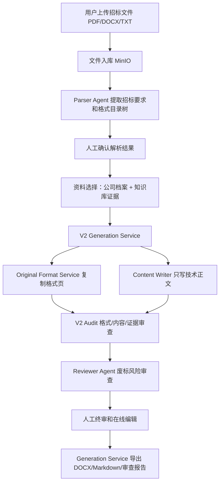

# TenderDoc-Generator

TenderDoc-Generator 是面向正奇建设投标场景的本地 MVP。当前生成内核只有一条主线：**以招标文件原始格式页为最高权威，复制格式，填真实字段，写技术正文，审查后交给人工终审。**

核心原则：

- 格式必须来自招标文件原文，商务文件、报价文件、函件、表格、签章位、下划线和附件说明不由模型重画。
- 已知事实来自招标文件、公司档案和知识库；没有证据的字段保留空白或交给人工确认。
- 生成失败、格式复制失败、正文写作失败或审查不过时，系统直接报错，不输出看似完整但可能废标的近似稿。

## 当前产品架构



### 自然语言流程

1. 用户创建项目并上传招标文件。
2. 后端提取全文，Parser Agent 生成结构化招标要求，包括项目名称、招标人、工期、质量、资质、评分项、废标项和 `format_outline_tree`。
3. 用户在工作台确认解析结果，系统自动生成大纲并直接进入可生成状态。
4. 用户在资料选择面板勾选本次投标要用的公司证件、人员证件、业绩、技术素材和图片资料。
5. 生成时，系统先从招标文件中复制“投标文件格式/响应文件格式”相关页面或 DOCX OOXML。
6. 商务文件和报价文件以复制出来的原格式为准；系统只做有依据的有限字段替换，未知字段保留下划线。
7. 技术文件正文由 Content Writer 根据招标要求、技术大纲和知识库证据写入。
8. V2 审查先挡格式、正文和证据问题，再进入废标风险审查。
9. 用户查看状态、审查报告和预览，在线编辑后人工确认。
10. 系统导出完整 DOCX、三卷 DOCX、Markdown 和审查报告；新点软件负责最终电子标封装、签章、加密和上传。

## 当前哪些代码管格式

| 文件 | 作用 | 对格式的影响 |
|------|------|--------------|
| `backend/services/original_docx_format_service.py` | 复制招标文件格式页 | DOCX 走 OOXML deepcopy；PDF 走整页图片 + 可编辑文本层 + 隐藏页标记，是格式保真的核心 |
| `backend/services/generation_service.py` | 导出和拆卷 | 原格式 DOCX 存在时按 OOXML/页块拆成商务、技术、报价三卷，并只给技术卷追加技术正文 |
| `backend/services/v2_generation_service.py` | V2 编排 | 决定是否启用原格式复制、何时失败、技术正文写入哪个卷 |
| `backend/services/format_skeleton_service.py` | 文本格式页提取 | 用于大纲、预览和非原格式文本路径，不是商务/报价精确保真的最终权威 |
| `backend/utils/docx_exporter.py` | 普通 Markdown 导出 | 负责字体、标题、表格、图片、页眉脚等普通排版；不应重画招标文件锁定格式 |
| `backend/agents/parser_agent.py` | 格式目录树提取 | `format_outline_tree` 用于导航和技术标题收集；`bid_format_requirements` 不再参与生成 |
| `frontend/components/ParsedReviewPanel.tsx` | 前端确认展示 | 展示解析结果供人工确认 |

## 当前哪些代码管审查

| 文件 | 作用 | 对审查的影响 |
|------|------|--------------|
| `backend/services/v2_audit_service.py` | V2 内置审查 | 格式层检查表格、下划线、签章位、图片/图表要求；内容层检查过短、元话语、金额/身份证等风险；证据层检查字段与公司档案 |
| `backend/agents/reviewer_agent.py` | 废标风险审查 | 规则审查为主，可选 LLM 审查；覆盖资质、废标条款、报价人工确认、评分响应等 |
| `backend/services/workflow_service.py` | 工作流状态和返修 | 记录上传、解析、生成、审查、确认、下载状态，保存失败原因和审查报告 |
| `backend/services/bid_tone_checker.py` | 语气检查 | 防止生成器语气、提示语、待办语进入投标正文 |
| `backend/agents/response_matrix_agent.py` | 响应矩阵 | 把资质、评分项、废标项映射到生成稿位置，辅助人工复核 |
| `backend/agents/scoring_agent.py` | 评分预测 | 模拟评分短板，不替代审查结论 |

## 主要能力

- 登录、注册、管理员注册码、用户权限。
- 项目创建、上传、解析、确认、资料选择、生成、审查、在线编辑、终审确认、下载。
- 工作台三栏布局：左栏上传+进度+资料选择，中栏 Tab 切换（解析确认/正文编辑/标书预览），右栏渐进展示分卷/审查/策略。
- 招标文件支持 PDF/DOCX/TXT；知识库支持 PDF/DOCX/TXT/JPG/JPEG/PNG 等资料入库和预览。
- 公司档案维护：企业信息、资质、账户、拟派项目班子。
- 知识库结构化标签：资料类别、册别、专业、地区、年份、证书类型、有效期、敏感级别、使用范围、核验状态、图片可插入等。
- 公司风格案例库：用于参考技术正文深度、语气和图片位，不控制投标文件结构。
- DOCX/Markdown/审查报告下载，支持三卷分册交付。

## 本地启动

首次安装：

```bash
./scripts/setup_local.sh
```

日常启动：

```bash
./scripts/dev_local.sh
```

默认入口：

- 前端工作台：http://localhost:3000
- 后端 API 文档：http://localhost:8000/docs
- MinIO Console：http://localhost:9001

更完整的安装、端口冲突、验证命令和常见问题见 [setup.md](setup.md)。

## 常用验证

```bash
.venv/bin/python -m pytest backend/tests -q
pnpm --dir frontend typecheck
pnpm --dir frontend build
```

不要并行执行 `pnpm --dir frontend typecheck` 和 `pnpm --dir frontend build`，Next.js build 会重建 `.next/types`。

## 主要 API

- `POST /api/project/create`：创建项目并上传招标文件。
- `PATCH /api/project/{id}/parsed`：保存人工确认版解析 JSON。
- `POST /api/project/{id}/outline`：生成默认大纲。
- `PATCH /api/project/{id}/outline`：保存人工调整后的大纲。
- `PATCH /api/project/{id}/knowledge-selection`：保存生成采用的知识片段。
- `POST /api/project/{id}/workflow/run`：运行工作流。
- `POST /api/project/{id}/confirm`：人工确认或提交修正意见。
- `PATCH /api/project/{id}/draft`：保存在线编辑正文。
- `GET /api/project/{id}/download?artifact=docx|markdown|review`：下载产物。
- `POST /api/knowledge/upload`：上传知识库资料并索引。
- `GET /api/knowledge/documents/{id}/preview`：预览文本、图片、PDF 或文件。
- `GET/PUT /api/company-profile`：读取/保存公司信息档案。

## 项目结构

```text
TenderDoc-Generator/
├── backend/
│   ├── agents/              # parser、content writer、reviewer、pricing、scoring、response matrix
│   ├── api/                 # FastAPI 路由
│   ├── rag/                 # embedding、pgvector 检索和过滤
│   ├── scripts/             # 质量评估、知识库 manifest、风格案例导入
│   ├── schemas/             # Pydantic schema
│   ├── services/            # workflow、generation、project、knowledge、template、company profile
│   ├── templates/           # 公司风格案例和离线评估样本
│   ├── utils/               # file parser、DOCX exporter、MinIO
│   └── tests/
├── frontend/
│   ├── app/                 # Next.js App Router 页面
│   ├── components/          # 工作台（Tab化三栏）、知识库、风格库、预览和编辑组件
│   └── lib/                 # API client、类型、Markdown 解析
├── docs/
├── scripts/
├── docker-compose.yml
├── setup.md
├── TECH_STACK.md
└── minitasks.md
```

## 生产化路线

当前仍是 localhost MVP。公司内网可用版还需要：单机 Docker Compose 部署、Nginx/HTTPS、任务队列、备份恢复、MinIO 安全策略、审计日志、权限细化和新点软件导入实测。详见 [minitasks.md](minitasks.md)。
