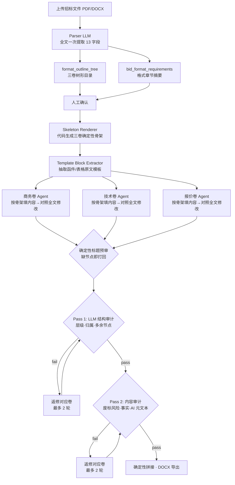

# TenderDoc-Generator

> 当前状态：本地 MVP 已跑通，生成内核已进入“招标文件格式优先”的 M1-M10 路线；M1/M2 已落地
> 目标交付日期：2026-08-08

TenderDoc-Generator 是面向正奇建设投标场景的智能标书生成系统。第一版不做泛行业通用投标软件，而是优先服务市政工程、公路工程、交通安全设施养护、公路改建/扩建/维修养护等正奇高频业务。

系统从招标文件解析开始，结合招标文件格式要求、企业知识库、可选公司风格案例、人工确认节点和审查 Agent，生成商务文件、技术文件、报价文件三卷草稿，并支持完整合并稿、DOCX 导出、废标风险审查、响应矩阵、评分预测和报价策略建议。

## 当前能力

已完成并通过测试的主链路：

- 用户登录、注册、管理员注册码、普通用户权限控制。
- 项目创建、历史项目列表、项目属主鉴权、项目恢复和删除。
- 招标文件上传，支持 PDF/DOCX/TXT 解析。
- Parser Agent 抽取项目名称、核心字段、资质要求、评分项、废标项和投标文件格式要求等结构化 JSON。
- 人工确认解析结果、大纲和投标文件格式要求；格式要求为空时后端拒绝进入生成，避免套默认结构造成废标风险。
- 招标文件格式要求是卷册、表单、签字盖章、正副本、密封/电子标要求的最高权威；默认模板不再自动参与线上生成。
- 公司风格案例库保留历史投标 PDF 资产，生成案例画像，记录写作深度、表格/图片位、禁用语气等风格资产；只有用户主动选择时才作为参考。
- 生成前会构建 `EvidencePack`，把公司证件、人员证件、业绩、技术方案、报价附件、表格附件和图片证据分开。
- 生成前会从 `format_outline_tree` 构建商务/技术/报价三卷确定性骨架；缺少完整三卷格式树时直接失败，不再套默认模板。
- 骨架渲染会从招标文件“投标文件格式/投标文件组成”附近抽取函件、表格和清单说明原文，优先嵌入招标文件原文模板；抽不到才使用空白占位。
- 默认生成模式为 multi_agent：商务/技术/报价三个 Agent 并行填充骨架并各自对照招标全文修改，总审双段检查（确定性标题预审 + LLM 结构审计 → 内容审计），打回返修最多两轮，最终确定性拼接导出。解析/生成失败即失败，不自动降级生成可能废标的内容。
- 商务文件、技术文件、报价文件三卷生成与预览，完整标书作为按需合并稿。
- Markdown 预览、在线编辑、保存草稿、再次审查和终审确认。
- DOCX 导出，支持封面、目录域、页眉页脚、页码、标题/正文中文排版和基础表格。
- 知识库上传、列表、预览、删除、重命名、结构化 metadata 标签和 RBAC。
- 知识库资料批量整理脚本：扫描本地/NAS 目录，生成建议文件名、metadata 标签、CSV/JSON manifest、整理后副本，并可按 manifest 导入本地知识库。
- RAG 检索支持按项目类型、资料类别、册别、专业、地区、年份、证书类型、敏感级别、使用范围、核验状态、标签等过滤。
- 知识库图片资料可作为生成候选，生成内容可以在合适位置插入图片引用；图片是否可插入由 `image_insertable` 控制。
- Markdown 和 DOCX 导出支持基础表格，前端预览可渲染 Markdown 表格。
- 报价策略 Agent：只输出策略、风险和人工确认点，不自动编造清单价格。
- 评分预测 Agent：按评分项模拟分数、短板和不确定性说明，不替代人工判断。
- 审查响应矩阵：覆盖资质、废标项、评分项和商务人工字段。
- 公司风格案例库：管理员上传历史投标 PDF，解析为脱敏案例 JSON 和风格画像，按项目类型/专业/信封/地区/年份推荐，但不自动套用、不控制招标文件格式。
- 离线脚本：模板解析、格式分析、标书生成 demo、质量评估、AI 与真实投标文件差距评估。

- 公司信息档案：`/company` 页维护企业工商、资质、账户和拟派项目班子信息，生成时自动注入投标人基本状况表、投标函落款等商务内容。
- 招标全文持久化（`projects.tender_text`），Parser 额外抽取招标人、建设地点、招标范围、计划工期、质量标准、安全目标、投标截止时间七个核心字段。

最近一次架构验证（2026-06-13）：

- 后端完整回归：`236 passed, 2 skipped`
- 前端类型检查：通过

## 当前架构



**五阶段流水线：**

| 阶段 | 做什么 | 关键技术 |
|------|--------|---------|
| 解析 | 全文直传 DeepSeek，一次提取项目名/资格/评分/废标/格式树 | `format_outline_tree` 树形目录 + 规则兜底 |
| 骨架先行 | 格式树 → 三卷 Markdown 骨架；格式树不完整直接失败 | `format_skeleton_service.py` |
| 原文模板 | 从格式章节抽取函件/表格/清单说明原文块，嵌回骨架 | `extract_format_template_blocks()` |
| Multi-Agent 生成 | 商务/技术/报价三 Agent 并行，只在骨架内填内容 | ThreadPoolExecutor + `volume_skeleton` |
| 双段审计 | 确定性标题预审 + LLM 结构审计，再查内容（废标/事实/AI 元文本） | 缺标题先代码打回，结构不过不跑内容 |
| 导出 | 按卷册标记确定性拼接，不靠 LLM 合稿 | `split_delivery_markdown()` → DOCX |

## 格式优先生成内核 M1-M10

这条路线替代“默认模板驱动生成”。核心判断是：投标文件结构必须来自本项目招标文件的格式章节，历史模板只能做风格和内容参考。

| 阶段 | 状态 | 目标 | 验收口径 |
|------|------|------|----------|
| M1 确定性格式骨架 | ✅ 已完成 | 从 `format_outline_tree` 生成商务/技术/报价三卷 Markdown 骨架 | 标题、顺序、层级来自招标文件；缺三卷格式树直接失败 |
| M2 原文模板抽取 | ✅ 已完成 | 从招标文件格式章节抽取函件、表格、清单说明原文并嵌入骨架 | 双信封同名投标函不混用；目录行不抢模板；泛标题不乱吸内容 |
| M3 节点级填槽 | ⬜ 待做 | LLM 不再输出整卷 Markdown，而是按节点逐个填槽 | 单节点失败可重试；标题和表头不由 LLM 重写 |
| M4 表格/字段结构化 | ⬜ 待做 | 把函件字段、表头、行列、签字盖章位解析为结构化对象 | 表格列顺序、必填字段、空白位可被程序审计 |
| M5 人工格式确认台 | ⬜ 待做 | 前端展示格式骨架和原文模板，允许制作员确认/修正 | 生成前可看到三卷完整目录、表单原文和缺失模板 |
| M6 DOCX 版式映射 | ⬜ 待做 | 将结构化表单/表格映射到 DOCX 表格、字号、页边距和分册 | Word 打开后表格不乱、标题层级稳定、分册可导入新点 |
| M7 知识库证据绑定 | ⬜ 待做 | 公司证件、人员证件、业绩、图片按格式节点绑定 | 商务节点能挂对应证件图片；技术节点能插入图表候选 |
| M8 合规硬审计 | ⬜ 待做 | 用代码审标题/表头/必填字段，LLM 只审内容风险 | 格式硬错误不进入下载；错误信息能定位到卷和节点 |
| M9 真实样本评测 | ⬜ 待做 | 用至少 3 个脱敏真实项目建立质量基线 | 目录完整率、表格一致率、人工修改量、废标风险检出率可量化 |
| M10 公司试用交付 | ⬜ 待做 | 内网部署、备份审计、队列稳定性、新点交付边界 | 公司制作员能在内网完成上传→生成→审查→导入新点前资料包 |

## 现有能力

第一版默认支持：

- 市政工程：道路、排水、管网、附属设施等。
- 公路工程：改建、扩建、维修、养护等。
- 交通安全设施：标志标线、护栏、防眩、隔离栅、交安设施养护等。
- 商务/技术/报价三卷独立生成与完整合并稿。

暂不作为第一版默认目标：

- 房建、园林、水利、机电、政府采购服务、货物采购等泛行业场景。
- 自动生成真实工程量清单报价、金额、费率或单价。
- 替代人工盖章、CA 签章、电子投标文件制作软件最终封装。

## 核心原则

系统当前最重要的边界在 [docs/generation_contract.md](docs/generation_contract.md)：

- `TenderRequirements` 回答“招标文件要求什么”，其中 `bid_format_requirements` 是投标文件格式确认关卡。
- 招标文件格式要求和人工确认目录是线上生成的结构来源；默认模板不再作为结构权威。
- `TemplateProfile` 是公司风格案例画像，负责把历史投标文件总结为写作深度、表格习惯、图片位和禁用语气。
- `EvidencePack` 是知识库资料的分类层，证件/图片/表格/技术素材不能混作同一种 RAG 文本。
- `BidPlan` 是生成阶段计划层，负责把人工确认目录、招标要求、可选风格案例画像和证据包落到每个章节。
- RAG/知识库主要负责资料治理、资料选择、证据供给和图片候选；生成时已选资料会作为证据进入对应分卷/节点，不再把 RAG 碎片当成章节结构来源。
- Generator prompt 只约束角色、文风、真实性和禁止事项。
- DOCX 视觉排版统一由 `backend/utils/docx_exporter.py` 负责。
- 离线脚本只做分析、评估、初始化和调试，不替代线上 API/service 链路。

## 本地启动

首次安装：

```bash
./scripts/setup_local.sh
```

日常启动：

```bash
./scripts/dev_local.sh
```

默认入口：

- 前端工作台：http://localhost:3000
- 后端 API 文档：http://localhost:8000/docs
- MinIO Console：http://localhost:9001

更完整的本地安装、端口冲突、验证命令和常见问题见 [setup.md](setup.md)。

## 常用验证

```bash
.venv/bin/python -m pytest backend/tests -q
pnpm --dir frontend typecheck
pnpm --dir frontend build
```

注意：不要把 `pnpm --dir frontend typecheck` 和 `pnpm --dir frontend build` 并行执行。Next.js build 会重建 `.next/types`，并行时可能导致 typecheck 读到临时缺失文件。

## 主要页面

- `/login`：登录/注册。
- `/projects`：历史项目。
- `/project/{projectId}`：标书工作台。
- `/knowledge`：知识库资料管理。
- `/company`：公司信息档案，管理员可编辑，生成时自动填入商务内容。
- `/templates`：公司风格案例库管理，管理员可写，普通用户只读或按权限查看。
- `/admin/users`：管理员用户与权限管理。

## 主要 API

- `POST /api/project/create`：创建项目并上传招标文件。
- `PATCH /api/project/{id}/parsed`：保存人工确认版解析 JSON。
- `POST /api/project/{id}/outline`：生成默认大纲。
- `PATCH /api/project/{id}/outline`：保存人工调整后的大纲。
- `PATCH /api/project/{id}/knowledge-selection`：保存生成采用的知识片段。
- `POST /api/project/{id}/workflow/run`：运行工作流。
- `POST /api/project/{id}/confirm`：人工确认或提交修正意见。
- `PATCH /api/project/{id}/draft`：保存在线编辑正文。
- `GET /api/project/{id}/download?artifact=docx|markdown|review`：下载产物。
- `POST /api/knowledge/upload`：上传知识库资料并索引。
- `GET /api/knowledge/documents`：列出知识库资料。
- `GET /api/knowledge/documents/{id}/preview`：预览文本、图片、PDF 或文件。
- `PATCH /api/knowledge/documents/{id}`：编辑资料标题和 metadata。
- `GET /api/knowledge/search`：按语义和 metadata 检索知识库。
- `POST /api/templates`：上传历史投标 PDF 并解析为公司风格案例。
- `GET /api/templates/recommend`：按项目上下文推荐风格案例。
- `GET/PUT /api/company-profile`：读取/保存公司信息档案（PUT 需管理员）。

## 知识库资料标签

知识库资料已从“只有 tags 的素材库”升级为结构化资料库。建议上传时尽量填写：

- `project_type`：市政工程、公路工程、交通安全设施养护、公路改建/扩建/维修养护。
- `document_category`：人员证件、公司证件、业绩、施工方案、历史投标文件、表格附件、图片资料等。
- `volume`：商务文件、技术文件、报价文件、资格文件、完整投标文件。
- `specialty`：道路、排水、桥梁、交安、养护、管网等。
- `region` / `project_year`：地区和年份。
- `owner_type` / `owner_name`：公司、人员、项目、设备等归属。
- `certificate_type`：建造师证、身份证、毕业证、建安证、交安证、职称证书、社保、营业执照、资质证书、安全生产许可证、开户许可证等。
- `valid_from` / `valid_to`：证件有效期。
- `sensitivity`：公开、内部、敏感、严格受限。
- `usage_scope`：可用于投标、仅参考、仅归档等。
- `verified_status`：已核验、待核验、已过期、需更新。
- `image_insertable`：图片是否允许作为标书插图候选。

批量整理时优先使用 manifest 流程：

1. 扫描原始资料目录，只生成 `knowledge_import_manifest.csv` 和整理后副本，不改原文件。
2. 人工抽查或编辑 manifest 中的 `suggested_filename`、`certificate_type`、`valid_to`、`image_insertable`、`review_required`。
3. 确认后再加 `--import-to-kb` 导入本地知识库；默认会跳过 `review_required=true` 的资料，除非显式加 `--include-review-required`。

## 项目结构

```text
TenderDoc-Generator/
├── backend/
│   ├── agents/              # parser/generator/reviewer/pricing/scoring/response matrix
│   ├── api/                 # FastAPI 路由
│   ├── rag/                 # embedding、pgvector 检索和过滤
│   ├── scripts/             # 案例导入、质量评估、知识库 manifest/批量入库
│   ├── schemas/             # Pydantic schema
│   ├── services/            # workflow、project、knowledge、template、evidence pack、bid plan
│   ├── templates/           # 历史案例/离线评估 JSON
│   ├── utils/               # file parser、DOCX exporter、MinIO、template parser
│   └── tests/
├── frontend/
│   ├── app/                 # Next.js App Router 页面
│   ├── components/          # 工作台、知识库、风格库、预览和编辑组件
│   └── lib/                 # API client、类型、Markdown 解析
├── docs/
├── scripts/                 # 本地启动、离线生成、格式分析、模板索引
├── docker-compose.yml
├── setup.md                 # 本地安装、启动、排障
└── minitasks.md             # 任务状态与路线图
```

## 技术栈速览

- 前端：Next.js 14 App Router + React 18 + TypeScript + Tailwind，pnpm 管理，API 用原生 fetch 封装（`frontend/lib/api.ts`）。
- 后端：FastAPI + uvicorn，Python 3.11（根目录 `.venv`），psycopg2 显式 SQL + 连接池，Pydantic v2，JWT 认证，FastAPI BackgroundTasks 跑长任务。
- AI：OpenAI SDK 兼容 DeepSeek/OpenRouter（`BID_LLM_PROVIDER` 显式路由）；默认 `multi_agent` 模式（格式骨架 + 原文模板抽取 + 商务/技术/报价三 Agent 分卷填充 + 双段审计 + 确定性拼接），失败后无 fallback。
- RAG：BAAI/bge-large-zh-v1.5（1024 维）+ pgvector，JSONB metadata 过滤。
- 存储：PostgreSQL 15+（JSONB + pgvector）、Redis 7（workflow state）、MinIO（原文/资料/产物）。
- 文档处理：pypdf/pdfplumber/PyMuPDF 解析，python-docx 导出（`backend/utils/docx_exporter.py` 统一排版）。

依赖事实以 `backend/requirements.txt` 和 `frontend/package.json` 为准。

## 协作约定

- `main` 必须始终保持可用：提交前跑 `pytest backend/tests` 和 `pnpm --dir frontend typecheck`。
- 涉及数据库表结构、环境变量、docker 配置的改动，必须在提交说明里写明。
- 未经脱敏的真实投标文件、证件资料禁止提交到 Git。

## 生产化路线（尚未实施）

当前是 localhost MVP。推向公司内网可用需要（详见 [minitasks.md](minitasks.md) 新 M10 以及历史 M69–M74）：

- 部署：单机 Docker Compose 内网起步，Nginx/HTTPS 反向代理。
- 队列：长任务从 BackgroundTasks 迁移到 Celery/RQ 等可重试队列。
- 数据：PostgreSQL 定时备份与恢复演练，MinIO 加密与版本保留，操作审计。
- 边界：本系统输出 Word/Markdown/资料包；新点投标软件负责最终电子标书制作、签章、加密、上传。

暂不引入：大型前端组件库重构、多租户、自动报价引擎、自动 CA 签章、NAS 无限制全量索引。

## 下一步

短期下一步不是继续堆大 prompt，而是沿新 M1–M10 路线继续把格式控制权交给代码。具体任务状态和优先级见 [minitasks.md](minitasks.md)：先做 M3 节点级填槽，再做 M5/M6 人工格式确认台和 DOCX 版式映射，随后补 M7/M8 知识库证据绑定与合规硬审计，最后用 M9/M10 推向真实样本评测和公司内网试用。
