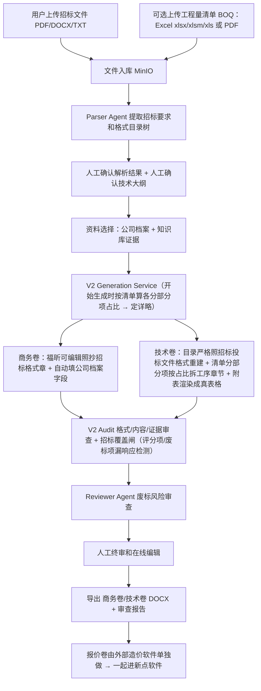

# TenderDoc-Generator

> 本文档最近同步：2026-07-02（商务卷证据链全面加强：三大选派/证件业绩插图锚点落位/简历表按台账自动填/格式医生体检修复/拟分包去重；技术卷附表逐张装配带"附表X"编号；RAG 语义重排接入生产；删 langchain 死依赖）。

TenderDoc-Generator 是面向正奇建设投标场景的本地 MVP。当前生成内核只有一条主线：**以招标文件原始格式页为最高权威，照抄商务格式并填真实字段，写技术正文，审查后交给人工终审。交付商务卷 + 技术卷两卷；报价卷由外部造价软件单独做，本系统不产出。**

核心原则：

- **招标要求是最高准则**：技术正文写作时，优先级为招标要求（评分项逐条正面响应、废标项一条不踩）> 工程量清单占比详略 > 知识库骨架；三者冲突一律以招标为准。
- 格式必须来自招标文件原文，商务文件的函件、表格、签章位、下划线和附件说明不由模型重画；技术卷目录严格照招标"投标文件格式"重建，不再退化成单节占位。
- 已知事实来自招标文件、公司档案、工程量清单和知识库；没有证据的字段保留空白或交给人工确认。知识库里的公司同类施工方案只当"骨架"打底（沿用结构/工艺/深度），数据一律换成本项目，严禁照搬旧项目数值/地名/项目名。
- 商务卷格式章与技术卷附表优先经福昕国内云 PDF→可编辑 Word 转换（真段落/真表格，非整页贴图），并自动填公司档案字段；福昕失败时自动下沉到 pdf2docx → 整页截图+域 → 纯整页图 → 硬报错（铁律：不输出空壳/近似稿）。纯文字版招标效果最好，扫描版需先 OCR。
- 格式复制失败或技术正文写作失败时，系统直接报错，不输出看似完整但可能废标的近似稿；审查发现严重问题时不抛错，而是阻断下游审查/导出流水线并保留草稿供人工预览修正。PDF 原格式路径会做内容体检，防空壳/丢页静默发布。
- **交卷前过一道"招标覆盖闸"**：逐条核对评分项是否正面响应、废标项是否实质规避，漏响应会标进审查报告（详见下方审查说明）。

## 当前产品架构


```mermaid
flowchart TD
    A["用户上传招标文件 PDF/DOCX/TXT"] --> B["文件入库 MinIO"]
    A2["可选上传工程量清单 BOQ：Excel xlsx/xlsm/xls 或 PDF"] --> B
    B --> C["Parser Agent 提取招标要求和格式目录树"]
    C --> D["人工确认解析结果 + 人工确认技术大纲"]
    D --> E["资料选择：公司档案 + 知识库证据"]
    E --> F["V2 Generation Service（开始生成时按清单算各分部分项占比 → 定详略）"]
    F --> G["商务卷：福昕可编辑照抄招标格式章 + 自动填公司档案字段"]
    F --> H["技术卷：目录严格照招标投标文件格式重建 + 清单分部分项按占比拆工序章节 + 附表渲染成真表格"]
    G --> I["V2 Audit 格式/内容/证据审查 + 招标覆盖闸（评分项/废标项漏响应检测）"]
    H --> I
    I --> J["Reviewer Agent 废标风险审查"]
    J --> K["人工终审和在线编辑"]
    K --> L["导出 商务卷/技术卷 DOCX + 审查报告"]
    L --> M["报价卷由外部造价软件单独做 → 一起进新点软件"]
```

### 自然语言流程

1. 用户创建项目并上传招标文件；可选另册上传**工程量清单（BOQ）**，支持 Excel（`.xlsx`/`.xlsm`/`.xls`）和 PDF。Excel 用 openpyxl 直接读（每行序列化成「单元格 | 单元格」喂给 LLM），旧版 `.xls` 走 LibreOffice 转换。上传清单只快速抽存全文即返回，**不在上传时同步算占比**（那会卡约 30 秒 LLM、把数据库连接池抢空报错）；真实占比改到点击"开始生成"时再按本清单计算。
2. 后端提取全文，Parser Agent 生成结构化招标要求，包括项目名称、招标人、工期、质量、资质、评分项、废标项和 `format_outline_tree`。
3. 用户在工作台确认解析结果；parser 从招标里扫"施工组织设计编制要点 + 附表清单"逐条原样列出（technical_outline），用户在中心标签「技术大纲」编辑器里人工确认技术卷目录（含「添加章节」），商务卷不需在此编辑（照抄招标格式）。
4. 用户在资料选择面板勾选本次投标要用的公司证件、人员证件、业绩、技术素材和图片资料。
5. 生成时，系统从招标文件复制"投标文件格式/响应文件格式"章节作为**商务卷**：开启 `CLOUD_PDF_CONVERT=foxit` 时经福昕云把 PDF 转成真·可编辑 Word（真段落/真表格），失败再依次下沉到 pdf2docx → 整页截图+域 → 纯整页图 → 硬报错。
6. 商务卷以原格式为准，走一条固定的**填空与体检管线**（`cloud_pdf_convert`）：福昕转换 → 理顺福昕切开的标签（"性 别"→"性别"）与**孤字归位**（"性…别："拼回"性别："，填前格式体检）→ 按标签自动填公司档案/台账字段（投标人/地址/法定代表人/资质、项目经理与总工**简历表按选派人员的台账结构化信息填**、业绩表填选中业绩、授权委托书/日期等）→ **格式医生**填后体检（治填空槽"下划线画一半"，只改格式一字不改）→ 清招标红章/页码 → 固定字段一致性收尾。未知字段保留空白。证件/业绩扫描图按招标要求**锚点落位**到对应表后（营业执照等→基本情况表后、法人身份证→身份证明后、项目经理/总工证件→各自资历表后、业绩证据→类似项目表后），锚点没命中退卷尾兜底、绝不丢图；拟分包表只保留福昕从招标带来的那张（不再重复注入资料库空表）。
7. **技术卷目录严格照招标"投标文件格式"重建**：检索正文前，系统先从招标抽"编制要点 + 附表清单"——有招标格式就照招标目录搭（编制要点成章、每张附表补成附表节），没有就回退按工程量清单分部分项 + 标准章节。施工方案按清单分部分项拆成工序章节：**占比越大拆越多道工序**（≥40% 拆 5 道 / ≥25% 拆 4 道 / ≥15% 拆 3 道 / ≥5% 拆 2 道 / 否则 1 道），每道工序单独成节、各跑一次 LLM（突破单节字数上限）；章节按施工逻辑排序（路基→排水→路面→桥涵→交安→绿化），占比只决定"写多少"、逻辑决定"先后"。这修掉了原来招标没识别出技术标结构时大纲退化成"施工组织设计"单节占位（技术卷只一节约 7 页、占比详略与逐节知识库检索全失效）的根因 bug。
8. **占比定详略**：占比大的分部分项加厚（主导最高 2.2 倍）、小的压缩（0.7 倍），基准目标字数 2200、单节硬底约 1800 字，确保占比极小的分部也不至于过薄。
9. **附表渲染成真表格 + 逐张装配**：附表节不走 LLM 空写；`appendix_service` 按招标要求的附表清单逐张定来源——①命中**公司定稿附表**（施工总平面图/劳动力/临时占地/外供电力等，`backend/assets/company_appendices/`）原样拼入并自动补"**附表X**"编号（目录与正文页都显示）；②否则从招标 PDF 该附表页福昕转可编辑表；③取不到则占位页提示人工。docxcompose 拼到技术卷末。技术卷 25 节 LLM 写作为有界并发（`BID_WRITER_CONCURRENCY` 默认 5），约 25min→约 5-6min。
10. V2 审查先挡格式、正文和证据问题，再过**招标覆盖闸**（逐条核评分项是否正面响应、废标项是否实质规避），最后进入 Reviewer 废标风险审查。
11. 用户查看状态、审查报告和预览，在线编辑后人工确认。
12. 系统导出商务卷 + 技术卷 DOCX、Markdown 和审查报告；报价卷由造价软件单独做；新点软件负责最终电子标封装、签章、加密和上传。

## 当前哪些代码管格式

| 文件 | 作用 | 对格式的影响 |
|------|------|--------------|
| `backend/services/original_docx_format_service.py` | 复制招标格式章 | 开关 `CLOUD_PDF_CONVERT=foxit` 时优先走福昕云 PDF→可编辑 Word（真段落/真表格）；失败下沉 pdf2docx → 整页截图+域（`_bake_fill_values_on_page`）→ 纯整页图 → 硬报错；`_audit_built_format_docx` 做内容体检防空壳 |
| `backend/services/generation_service.py` | 两卷装配和导出 | `_assemble_two_volumes`：商务卷=copy2 格式章+合规正文，技术卷=独立生成正文+可编辑附表（docxcompose 拼到卷末）；不再三卷拆分 |
| `backend/services/v2_generation_service.py` | V2 编排 + 附表渲染 | 决定原格式复制、失败语义；`_collect_technical_sections` 优先读人工确认的 `bid_outline_json` 驱动技术卷目录；`_is_appendix_title`/`_appendix_markdown` 把招标附表节渲染成真表格（不走 LLM 空写）；25 节 LLM 有界并发（`BID_WRITER_CONCURRENCY` 默认 5）；基准字数 `_CONFIRMED_OUTLINE_TARGET_CHARS=2200` |
| `backend/services/workflow_service.py`（大纲重建段） | 技术卷目录严格照招标格式重建 | 检索前 `_expand_thin_outline`：`_extract_tender_format_structure` 抽"编制要点+附表清单"，有招标格式走 `_tender_format_outline`、无则 `_boq_discipline_fallback`；`_discipline_sections` 按清单分部分项拆工序节，`_subsection_count` 按占比定拆几道工序，`_construction_rank` 按施工逻辑（路基→排水→路面→桥涵→交安→绿化）排序 |
| `backend/services/boq_service.py` | 工程量清单占比与详略 | `build_boq` 算各分部分项占比；`adjust_min_chars` 按占比定详略（主导最高 2.2 倍、小占比 0.7 倍）；驱动技术卷"占比大的多写、小的精简" |
| `backend/utils/file_parser.py` | 工程量清单解析 | `extract_text_from_xlsx`（openpyxl 读 xlsx/xlsm，行序列化「单元格 | 单元格」）+ `.xls` 走 LibreOffice；`SUPPORTED_EXTENSIONS` 含 `.xlsx`/`.xlsm`/`.xls` |
| `backend/services/cloud_pdf_convert.py` | 福昕云转换 + 商务卷填空管线 | 转换后依次：标签理顺/孤字归位（填前体检）→ 字段自动填（基本情况表/人员表/业绩表/简历表/授权委托书/日期）→ 格式医生（填后体检）→ 清红章/招标页码 → 固定字段一致性收尾 |
| `backend/services/docx_format_doctor.py` | 格式医生（体检修复，healer 注册制） | 填前：孤字归位（"性…别："拼回"性别："，字符守恒）；填后：填空槽下划线断线补齐（白名单=profile 里我们填的值 + 夹心兜底）；铁律只改格式、绝不改文字 |
| `backend/services/appendix_service.py` | 技术卷附表逐张装配 | 公司定稿表原样拼（自动补"附表X"编号）→ 招标原表福昕转 → 占位页；docxcompose 拼接 |
| `backend/utils/docx_exporter.py` | 技术卷 Markdown 导出 | 负责字体、标题、表格、图片、自动更新目录域等排版；不重画招标锁定格式 |
| `backend/agents/parser_agent.py` | 格式目录树提取 | `format_outline_tree` 用于导航；另扫"施工组织设计编制要点 + 附表清单"成 `technical_outline`（逐条原样、不合并），驱动人工确认的技术卷目录；`max_tokens` 按输入长度动态算 |
| `frontend/components/ParsedReviewPanel.tsx` | 前端确认展示 | 展示解析结果供人工确认 |

## 当前哪些代码管审查

| 文件 | 作用 | 对审查的影响 |
|------|------|--------------|
| `backend/services/v2_audit_service.py` | V2 内置审查 + 招标覆盖闸 | 格式层检查表格、下划线、签章位、图片/图表要求；内容层检查过短、元话语、金额/身份证等风险；证据层检查字段与公司档案；**招标覆盖闸**（`prompts/coverage_audit_prompt.py`）交卷前逐条核"评分项是否正面响应/废标项是否实质规避"，并入 `full_audit`，废标漏=critical、评分漏=major；判定优先 LLM 评标视角语义判定，**废标项绝不靠关键词/bigram 放行**（废标条款原文常被抄进承诺表，关键词重合会把真违规误判成已覆盖），LLM 不可用时 bigram 只兜底放宽评分项 |
| `backend/agents/reviewer_agent.py` | 废标风险审查 | 规则审查为主，可选 LLM 审查；覆盖资质、废标条款、报价人工确认、评分响应等 |
| `backend/services/workflow_service.py` | 工作流状态和返修 | 记录上传、解析、生成、审查、确认、下载状态，保存失败原因和审查报告 |
| `backend/services/bid_tone_checker.py` | 语气检查 | 防止生成器语气、提示语、待办语进入投标正文 |
| `backend/agents/response_matrix_agent.py` | 响应矩阵 | 把资质、评分项、废标项映射到生成稿位置，辅助人工复核 |
| `backend/agents/scoring_agent.py` | 评分预测 | 模拟评分短板，不替代审查结论 |

## 主要能力

- 登录、注册、管理员注册码、用户权限。
- 项目创建、上传、解析、确认、资料选择、生成、审查、在线编辑、终审确认、下载。
- **工程量清单（BOQ）驱动技术卷**：另册上传清单（Excel `.xlsx`/`.xlsm`/`.xls` 或 PDF），系统按真实占比定详略——占比大的分部分项多写、小的精简，并把真实工程量喂给对应施工方案章节。
- **技术卷目录严格照招标"投标文件格式"**：编制要点成章、附表逐张补成节；施工方案按清单分部分项拆工序章节（占比越大拆越多道工序），章节按施工逻辑排序。
- **附表渲染成真表格**：总体作业计划表/劳动力计划表/临时占地计划表/外供电力需求计划表等渲染成 docx 表格（数据格人工填），施工总平面图渲染成图片占位 + 说明文字。
- **防废标"招标覆盖闸"**：交卷前逐条核对评分项是否正面响应、废标项是否实质规避，漏响应写进审查报告（废标漏=critical、评分漏=major），某节未响应招标要求时可定向重写该节（best-effort）。
- 工作台三栏布局：左栏上传+进度+资料选择（含工程量清单上传），中栏 Tab 切换（解析确认/技术大纲/正文编辑/标书预览），右栏渐进展示分卷/审查/策略；「技术大纲」编辑器供人工确认技术卷目录并「添加章节」；顶部「新项目」按钮可不退出登录直接开新标。
- 商务卷格式章 + 技术卷附表经福昕云转成真·可编辑 Word（WPS 级：肉眼一致 + 可编辑），并自动填公司档案字段；极复杂表偶尔需人工微调。
- **商务卷证据链（三大选派驱动）**：工作台可选派项目经理/项目总工（单选）与类似业绩（多选）；选定后简历表按台账结构化信息自动填（职称/注册建造师证号/专业，年龄性别由身份证号推算），证件与业绩扫描图按招标要求锚点落位到对应表后，身份证经 OCR 自动分正反面、扫描件按 EXIF 自动摆正。
- **格式医生**：福昕转换+填空前后的全文档格式体检（孤字归位/切开标签理顺/下划线断线补齐），只改格式、一字不改；新病种往 `_HEALERS` 注册，不再散落打补丁。
- 知识库检索生产启用 **bge-reranker 语义重排**（懂"沥青混凝土≈路面"这类同义；模型不可用自动回退关键词重排，检索绝不因此报错）。
- 招标文件支持 PDF/DOCX/TXT；工程量清单额外支持 Excel（`.xlsx`/`.xlsm`/`.xls`）；知识库支持 PDF/DOCX/TXT/JPG/JPEG/PNG 等资料入库和预览。
- 公司档案维护：企业信息、资质、账户、拟派项目班子。
- 知识库结构化标签：资料类别、册别、专业、地区、年份、证书类型、有效期、敏感级别、使用范围、核验状态、图片可插入等。
- **商务卷 + 技术卷 DOCX + Markdown + 审查报告下载（两卷交付，报价卷由外部造价软件单独做）。**

## 本地启动

首次安装：

```bash
./scripts/setup_local.sh
```

日常启动：

```bash
./scripts/dev_local.sh
```

默认入口：

- 前端工作台：http://localhost:3000
- 后端 API 文档：http://localhost:8000/docs
- MinIO Console：http://localhost:9001

福昕可编辑转换相关配置（`.env`）：

- `CLOUD_PDF_CONVERT=foxit`：开启福昕国内云 PDF→可编辑 Word（不开则走 pdf2docx/截图链）。
- `FOXIT_CLOUD_CLIENT_ID` / `FOXIT_CLOUD_CLIENT_SECRET`：福昕云凭证。
- `BID_WRITER_CONCURRENCY`（默认 5）：技术卷分节写作的并发上限。
- `ENABLE_COVERAGE_AUDIT`（默认 True）：是否启用交卷前"招标覆盖闸"。
- `COVERAGE_AUDIT_BLOCK_INVALID`（默认 False）：废标漏响应是否硬拦。**当前默认不硬拦、只判 major**——因"初步评审不通过/报价超限价"等规则类废标项任何标书都不会专门写段响应，硬拦会对每份标误锁死；待废标项按"实质响应类 vs 规则约束类"分类后再切回硬拦。
- 依赖新增 `docxcompose==2.2.0`（把可编辑附表拼到技术卷末尾）、`openpyxl`（读工程量清单 Excel）；已删除从未使用的 `langchain`/`langchain-community`/`langchain-openai` 三包（源码零引用，纯瘦身）。
- 数据库连接池 `core/db.py` `maxconn` 已从 10 提到 20，缓解"上传+轮询+生成"突发并发抢空连接报 PoolError。

更完整的安装、端口冲突、验证命令和常见问题见 [setup.md](setup.md)。

## 常用验证

```bash
.venv/bin/python -m pytest backend/tests -q -m "not live_llm"
pnpm --dir frontend typecheck
pnpm --dir frontend build
```

不要并行执行 `pnpm --dir frontend typecheck` 和 `pnpm --dir frontend build`，Next.js build 会重建 `.next/types`。

已加 GitHub Actions CI（`.github/workflows/ci.yml`）：后端 job 跑 `pytest -m "not live_llm"`，前端 job 跑 typecheck/lint/test/build 四连。

## 主要 API

- `POST /api/project/create`：创建项目并上传招标文件。
- `POST /api/project/{id}/boq`：上传本项目工程量清单（Excel/PDF，另册）；只快速抽存全文，占比在"开始生成"时再算。
- `GET /api/project/{id}/boq`：查询是否已上传清单及字数。
- `DELETE /api/project/{id}/boq`：删除已上传的工程量清单。
- `PATCH /api/project/{id}/parsed`：保存人工确认版解析 JSON。
- `POST /api/project/{id}/outline`：生成默认大纲。
- `PATCH /api/project/{id}/outline`：保存人工调整后的大纲。
- `PATCH /api/project/{id}/knowledge-selection`：保存生成采用的知识片段。
- `POST /api/project/{id}/workflow/run`：运行工作流。
- `POST /api/project/{id}/confirm`：人工确认或提交修正意见。
- `PATCH /api/project/{id}/draft`：保存在线编辑正文。
- `GET /api/project/{id}/download?artifact=docx|markdown|review`：下载产物。
- `POST /api/knowledge/upload`：上传知识库资料并索引。
- `GET /api/knowledge/documents/{id}/preview`：预览文本、图片、PDF 或文件。
- `GET/PUT /api/company-profile`：读取/保存公司信息档案。

## 项目结构

```text
TenderDoc-Generator/
├── .github/                 # CI 工作流（GitHub Actions）
├── backend/
│   ├── agents/              # parser、content writer、reviewer、pricing、scoring、response matrix
│   ├── api/                 # FastAPI 应用装配（main.py）+ routers/ 按域分路由 + deps.py 共享依赖
│   ├── core/                # config + llm_client（统一 LLM 客户端/重试退避）
│   ├── rag/                 # embedding、pgvector 检索和过滤
│   ├── scripts/             # 质量评估、知识库 manifest、资料导入
│   ├── schemas/             # Pydantic schema
│   ├── services/            # workflow、generation、knowledge、template、company profile；project 为子包（services/project/）；docx_health_check（标书体检打分）、delivery_quality（出标自动打分）
│   ├── utils/               # file parser、DOCX exporter、MinIO
│   └── tests/
├── frontend/
│   ├── app/                 # Next.js App Router 页面
│   ├── components/          # 工作台（Tab化三栏）、知识库、公司档案、预览和编辑组件
│   └── lib/                 # API client、类型、Markdown 解析
├── docs/
├── scripts/
├── docker-compose.yml
├── setup.md
├── TECH_STACK.md
└── minitasks.md
```

## 生产化路线

当前仍是 localhost MVP。公司内网可用版还需要：单机 Docker Compose 部署、Nginx/HTTPS、任务队列、备份恢复、MinIO 安全策略、审计日志、权限细化和新点软件导入实测。详见 [minitasks.md](minitasks.md)。
