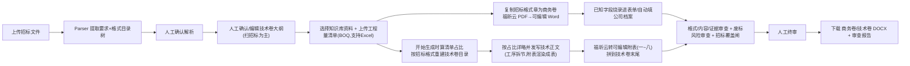

# TenderDoc-Generator 任务状态与路线图

本文只记录当前版本、当前路线和下一步任务。开发史请看 Git，不放在产品文档里。

**当前版本：** V2 原格式复制生成内核（两卷交付）｜更新日期 2026-07-09
**当前重点：** 公司内网**局域网部署**（Docker 一键版已就绪，见 [`docs/局域网部署指南.md`](docs/局域网部署指南.md)，待 Windows 主机实测）、等用户重建知识库（清理后数据+规范命名）后陪跑整链、商务卷证据链打磨（浮动文本框问题待重做）、防废标覆盖闸 P1、新点软件交付实测
**硬边界：** 招标文件原格式页是最高权威；系统不输出近似重画格式稿。技术正文最高准则=招标要求（评分项逐条响应、废标项一条不踩）> BOQ 占比详略 > 知识库骨架，冲突以招标为准。

## 当前主流程

## 交付与格式铁律（现状）

- **两卷交付：商务卷 + 技术卷。报价卷由外部造价软件单独做，本系统不产出。**
- **商务卷 = 照抄招标格式章 + 字段自动填 + 合规正文**。
  - PDF 招标：**优先福昕国内云转可编辑 Word**（真段落/真表格，开关 `CLOUD_PDF_CONVERT=foxit`）+ 自动填公司档案（投标人/地址/法代/资质等）；云失败自动下沉 pdf2docx → 整页截图+域 → 纯整页图 → 硬报错。纯文字版招标最佳，扫描版需先 OCR。
  - DOCX 招标：**copy-then-prune**（复制源文件、删格式章外元素），保留页眉页脚/图片/表格。
- **技术卷 = 人工确认目录 + LLM 写的施工组织设计正文 + 福昕可编辑附表**（附表一~八，数据格留空人工填，docxcompose 拼到卷末另起页），正奇排版 + 自动更新目录，不与商务格式页混排。
- **技术卷目录严格按招标"投标文件格式"搭**：有招标格式→照招标目录（编制要点成章 + 每张附表补成附表节）；无招标格式→按工程量清单分部分项 + 标准章节兜底。施工方案按清单分部分项展开成工序章节，**占比越大拆越多道工序**（每道工序单独成节、各一次 LLM 调用，突破单节字数上限），但章节先后由施工逻辑定（路基→排水→路面→桥涵→交安→绿化），占比只决定"写多少"。
- **附表节渲染成真表格**（总体作业计划表 / 劳动力计划表 / 临时占地计划表 / 外供电力需求计划表用 Markdown 表格、施工总平面图为图占位），不走 LLM 空写。
- **占比详略**：占比大加厚、小压缩，主导分部分项最高 2.2 倍；同时有约 1200 字硬底兜底，占比极小的分部不会被压没。
- **交卷前过"招标覆盖闸"防废标**：逐条核每个评分项是否正面响应、每条废标项是否实质规避，未响应的节点定向重写。
- 失败语义：格式复制 / 技术正文写作失败 = 硬错误直接报错；审查发现严重问题 = 软阻断（`audit_blocked=True`，保留草稿供人工预览）。

## 已完成

| 编号 | 状态 | 内容 | 验收重点 |
|------|------|------|----------|
| M1 | ✅ | DOCX 招标格式章 copy-then-prune 复制 | 表格/合并单元格/下划线/签章位/**页眉页脚/图片**保留 |
| M2 | ✅ | PDF 招标格式整页截图 + 值烧录进图 | 像素级保真、全软件可渲染、知识库字段已填、未知留空 |
| M4 | ✅ | V2 唯一生成入口 | 工作流只调用 `generate_v2_bid_package()` |
| M5 | ✅ | Content Writer 模型路由 | 尊重 `BID_LLM_PROVIDER=deepseek/openrouter/auto` |
| M6 | ✅ | 无占位正文输出 | 技术正文写作失败直接报错 |
| M7 | ✅ | 三层审查 | V2 格式/内容/证据审查 + reviewer 废标风险审查 |
| M9 | ✅ | 前端 UX | 移除大纲编辑、Tab 化中心列、渐进展示、**两卷下载（去报价）** |
| M10 | ✅ | 技术正文深度大纲 | 逐节注入评分项/废标项/必覆盖要点/字数预算+不达标重写。**注：M22 后目录改由人工确认/招标扫描驱动，薄大纲不再自动套 25 节模板（每份招标不同，有的目录就简单）；深度大纲仅作可选参考。****E2E 实测(招标#1,空知识库)：技术正文 6K→76,875 字(≈13×,超中标标书全卷)、25 节、评分点 3/3、审查通过、内容真材实料(C30面层180mm/级配/压实度等工程参数+项目针对性)** |
| M11 | ✅ | 真实中标标书基线 | `benchmark_vs_baseline.py` + `docs/quality_scorecard.md`，4 份脱敏中标标书 + 4 份招标文件 |
| M12 | ✅ | 知识库真实资料入库 | 证件库（公司 106 + 人员 2568）+ 业绩台账 253 已导入，KB ≈2941 docs / 5022+ chunks；公司档案 12 字段填满（地址/法代/资质/安许号/电话等）；按 sha1 去重。**技术方案文本不灌全局库——改走"本项目专用技术材料库"（见当前进行中），因为施工组织设计因项目/专业而异** |
| M13 | ✅ | 样本项目端到端验收 | 招标#1–#4 格式跑通（#4 DOCX 定位 bug 已修）；技术正文 E2E 实测 76,875 字 / 25 节 / 评分点 3-3 / 审查通过。剩 #2–#4 含 LLM 正文的完整端到端可后续抽测 |
| M15 | ✅ | 视觉回归 | `backend/scripts/visual_regression.py`（soffice 渲染断言）+ `docs/visual_review_checklist.md` |
| M16 | ✅ | 知识库 OCR | RapidOCR（`rapidocr-onnxruntime`，无系统二进制）落地；证件扫描件（JPG/PNG）文字提取，证号/有效期/资质等级可检索可填空；图片证件各 mode 均 OCR |
| M22 | ✅ | 技术卷大纲人工确认 | 放出大纲编辑器（中心标签「技术大纲」+「添加章节」）；parser 扫招标"编制要点+附表"逐条原样（`technical_outline`）；`_collect_technical_sections` 优先读人工确认的 `bid_outline_json` 驱动目录、无规定时给最小中性壳（不再盲套硬编码大纲）；商务卷移出大纲环节。已合 main |
| M24 | ✅ | 福昕云 PDF→可编辑Word（格式复制升级） | 商务格式章 + 技术附表经福昕国内云转**真·可编辑 Word**（非贴图）+ 自动填字段；Phase0 最上层（`CLOUD_PDF_CONVERT=foxit`）失败下沉 pdf2docx→图；附表 docxcompose 拼技术卷末；P0-2 内容体检防空壳。**解决"可编辑 vs 一模一样"取舍**。实测招标#122：商务 168 段 19 表 + 附表 6 可编辑表 + 字段已填 |
| M25 | ✅ | 工程量清单(BOQ)支持 Excel 上传 | `utils/file_parser.py extract_text_from_xlsx`（openpyxl 读 .xlsx/.xlsm，行序列化"单元格\|单元格"；旧版 .xls 走 LibreOffice 转）；`SUPPORTED_EXTENSIONS` 加 .xlsx/.xlsm/.xls；前端 `ProjectBOQPanel` 放开 accept。BOQ 上传接口改为**上传时只快速抽存清单全文即返回**（不再同步算占比，原同步 ~30s LLM 把 DB 连接池抢空报 PoolError）；**真实占比改到"开始生成"时算** |
| M26 | ✅ | 技术卷大纲严格按招标"投标文件格式"重建 | 修根因 bug：招标没识别出技术标结构时大纲原退化成"施工组织设计"一节占位（技术卷只一节 ~7 页、占比详略与逐节检索全失效）。现 `_expand_thin_outline`（检索前重建）：`_extract_tender_format_structure` 抽"编制要点+附表清单"；有招标格式→`_tender_format_outline` 照招标目录搭，无→`_boq_discipline_fallback`（清单分部分项+标准章节）。施工方案按清单分部分项→`_discipline_sections` 工序章节：占比越大拆越多道工序（≥40%:5 / ≥25%:4 / ≥15%:3 / ≥5%:2 / else 1），每道工序单独成节（各一次 LLM 调用，突破单节 ~5000 字上限）；章节按 `_construction_rank` 施工逻辑排（路基→排水→路面→桥涵→交安→绿化），占比只决定写多少 |
| M27 | ✅ | 附表渲染成真表格 | `v2_generation_service.py _is_appendix_title/_appendix_markdown`：附表节不走 LLM 空写，渲染成 Markdown 表格（总体作业计划表/劳动力计划表/临时占地计划表/外供电力需求计划表；施工总平面图为图占位），`markdown_to_docx` 转 docx 表格 |
| M28 | ✅ | 占比详略加强 | `boq_service.py adjust_min_chars`：占比大加厚小压缩，主导分部分项最高 2.2 倍；基准 `_CONFIRMED_OUTLINE_TARGET_CHARS` 1500→2200，最低 `MIN_NODE_CONTENT_CHARS` 1200→1800 |
| M29 | ✅ | 防废标"招标覆盖闸"（告警模式） | `v2_audit_service.py` + `prompts/coverage_audit_prompt.py`：交卷前逐条核"评分项是否正面响应/废标项是否实质规避"，并入 `full_audit`。判定优先 LLM 评标视角语义判定，**废标项绝不靠关键词/bigram 放行**（废标条款原文常被抄进承诺表，关键词重合会误判）；LLM 不可用时 bigram 只兜底放宽评分项。**当前告警模式**：`coverage_audit_block_invalid` 默认 False→废标漏判 major 不硬拦（"初步评审不通过/报价超限价"等规则类废标项任何标书都不会专门写段响应，硬拦会对每份标误锁死）；总开关 `enable_coverage_audit` 默认 True。定向补写：某节未响应→`content_writer.rewrite_node_for_compliance` 重写该节（best-effort） |
| M30 | ✅ | 生成提示词最高准则置顶 | `prompts/generator_prompt.py`：写作规则置顶"最高准则=招标要求（评分项逐条响应/废标项一条不踩）> BOQ 占比详略 > 知识库骨架"，冲突以招标为准；评分项/废标项标题强化；工序步骤按施工先后排；知识库"公司同类施工方案"当骨架打底（沿用结构/工艺/深度，数据换本项目，严禁照搬旧项目数值/地名/项目名） |
| M33 | ✅ | 商务卷证据链（三大选派驱动） | 工作台选派项目经理/总工（单选）+类似业绩（多选），存 `projects.selected_personnel/selected_performance`；生成只用选中的：简历表按台账结构化信息填（证号/职称/专业，年龄性别由身份证号推算，总工与项目经理对称）、证件/业绩扫描图按招标要求锚点落位到对应表后（`_ANCHOR_SPECS` 表头关键词，没命中退卷尾绝不丢图）、身份证 OCR 分正反面、扫描件 EXIF 摆正 |
| M34 | ✅ | 技术卷附表逐张装配 + "附表X"编号 | `services/appendix_service.py`：公司定稿表原样拼并补"附表X"编号（目录与正文页一致）→ 招标原表福昕转 → 占位页；docxcompose 拼卷末 |
| M35 | ✅ | 商务卷格式医生 + 拟分包去重 | `services/docx_format_doctor.py`（healer 注册制，只改格式一字不改）：填前孤字归位（"性…别："拼回"性别："）、填后下划线断线补齐（白名单+夹心）；`_normalize_split_labels` 理顺切开标签；拟分包表不再重复注入（福昕已带招标那张）。均在真实文件上渲染前后对比验收 |
| M36 | ✅ | RAG 语义重排接生产 + 依赖瘦身 | `rag/retriever.rerank_results`：优先 bge-reranker（懂同义）、失败回退关键词；删 langchain 三包（源码零引用）；parser 评分项 title/description 互相回填（漏字段不再炸解析） |
| - | ✅ | DB 连接池扩容 | `core/db.py` maxconn 10→20（缓解生成期并发占池） |
| - | ✅ | 技术卷生成并行化 | 25 节逐节 LLM 改有界并发（`ThreadPoolExecutor`，`BID_WRITER_CONCURRENCY` 默认 5），约 25min→5-6min |
| - | ✅ | 两卷重构 | 删除旧三卷拆分整链；`_assemble_two_volumes` 为唯一原格式导出路径 |
| - | ✅ | 结构重构 + 工程化 | `api/main.py` 拆 router（1004→~75 行）、`project_service` 拆 `services/project/` 包（1396→~122 行门面）、抽 `core/llm_client`（统一 provider + LLM 重试退避）；新增 CI（`.github/workflows/ci.yml`,后端 pytest + 前端 typecheck/lint/test/build,已实跑通过)、前端 vitest 地基（覆盖 `lib/api.ts`）；后端测试 287→311 passed |

## 当前进行中

| 编号 | 状态 | 内容 | 验收标准 |
|------|------|------|----------|
| M23 | 🔬 | 本项目专用技术材料库 | **引擎已建并 push（main `988f02d`）**：入库 `store_knowledge_chunks(project_id=)` 写 documents 真列 + 冗余进 chunk metadata；检索 `retrieve_filtered(project_id=)` 三态隔离（仅全局 / 项目∪全局 / chunk_ids 绕过）；`_retrieve_for_outline` 串 project_id；端点 POST/GET/DELETE `/api/project/{id}/material`（authorized_project 鉴权）；前端「技术大纲」页 `ProjectMaterialPanel` 上传/列表/删除。门禁 340+14。**剩待用户提供真实施工组织设计样本做端到端验证**（传入后生成的技术卷是否真的引用了素材、少编） |

## 下一步该做什么（按优先级）

**最高优先（决定能不能真正中标 / 真正能用）：**

| 编号 | 优先级 | 内容 | 为什么是下一步 |
|------|--------|------|----------------|
| **M23** | **P0** | **本项目专用技术材料库**（进行中） | M12/M16 已完成（证件/业绩入库 + OCR + 公司档案填满）。技术卷质量的**下一个真正瓶颈是"无真实施工方案素材"**——全局库零技术文本。解法：每项目上传同类施工组织设计参考、`project_id` 隔离喂 RAG，而非灌全局库（施工组织设计因项目/专业而异）。 |
| **M20** | **P0** | **新点软件交付实测** | 用导出的**商务卷（烧录图 DOCX）+ 技术卷**在新点投标文件制作软件里导入，记录损失项（图能否进、字段能否套打、目录是否正常）。验证整条链路在真实投标工具里可用。 |

**其后（生产化/打磨）：**

| 编号 | 优先级 | 内容 | 说明 |
|------|--------|------|------|
| M31 | P1 | 覆盖闸废标项分类后切硬拦 | 当前覆盖闸为告警模式（废标漏判 major 不硬拦）。待把废标项按"实质响应类 vs 规则约束类"分类后，对"实质响应类"切回硬拦（`coverage_audit_block_invalid=True`），规则约束类继续只告警，避免误锁死每份标 |
| M32 | P1（可选） | TOC 服务端预填 | 技术卷目录(TOC)是 Word 域，文件已设打开自动更新；非 Word 预览软件需手动更新。可选改进：导出时服务端预填一份页码 TOC 文本，预览软件也能直接看到 |
| M14 | P1 | 真实格式回归集 | 把 4 份招标文件的格式生成接入自动回归（现为手测） |
| M17 | P1 | 内网部署包 | Docker Compose 单机版、Nginx、HTTPS、环境变量模板 |
| M18 | P1 | 备份恢复和审计 | PostgreSQL/MinIO 备份、恢复演练、上传下载删除审计日志 |
| M19 | P1 | 长任务队列 | 解析/生成/导出从守护线程（threading.Thread daemon）迁移到可重试队列（生成现需 25 节 LLM、耗时长） |
| - | P2 | benchmark 按卷拆分响应率 | 技术评分项 vs 技术正文、商务/报价废标 vs 商务卷+reviewer，分母分开。**按卷打分已实现于 `docx_health_check.score_delivery`；benchmark 响应率拆分仍可补。** |
| - | P2 | PDF 健壮性 | 页旋转检测、超大/超小页缩放、密集表格文本 |
| ~~M21~~ | 已删 | ~~风格案例质量化~~ | **风格库已整体删除（2026-07-03）**：从未影响写作提示词、大纲兜底被更强的重建机制盖过，纯挂名功能；后端 template_service/路由/前端页面/数据全清，DB 的 projects.template_id 列保留不读 |

## 格式相关代码责任

- `backend/services/cloud_pdf_convert.py`：福昕国内云 PDF→可编辑 Word（`convert_pdf_to_docx_via_foxit` + 商务/附表包装）；纯 httpx 调用、SN 签名、create→轮询→download。
- `backend/services/original_docx_format_service.py`：格式章复制与回退。DOCX 走 copy-then-prune；PDF 走 pdf2docx 可编辑 → 整页截图+域（`_bake_fill_values_on_page`）→ 纯整页图；`_find_format_page_range_in_pdf` / `_find_appendix_page_range_in_pdf` 定位商务/附表页区。
- `backend/services/generation_service.py`：两卷装配 `_assemble_two_volumes`（商务=copy2 格式章+合规正文，技术=独立生成正文）+ `_append_docx`（docxcompose 把附表拼到技术卷末、先校验再原子替换）和导出。
- `backend/services/v2_generation_service.py`：生成编排 + `_sections_from_confirmed_outline`（读人工确认的 `bid_outline_json` 驱动目录）+ `_collect_technical_sections`（旧回退：忠实跟招标，无则最小壳，不再展开 25 节）+ `_is_appendix_title/_appendix_markdown`（附表节渲染成真表格，不走 LLM 空写）。
- `backend/services/workflow_service.py`：技术卷大纲检索前重建——`_expand_thin_outline`（薄大纲重建总入口）/`_extract_tender_format_structure`（抽招标"编制要点+附表"）/`_tender_format_outline`（照招标目录搭）/`_boq_discipline_fallback`（无招标格式时按清单分部分项+标准章节兜底）/`_discipline_sections`（清单分部分项→工序章节，占比越大拆越多道工序）/`_construction_rank`（章节按施工逻辑排序）。
- `backend/services/boq_service.py`：工程量清单解析 + `adjust_min_chars`（按占比定详略，主导 2.2 倍，硬底兜底）。
- `backend/utils/file_parser.py`：`extract_text_from_xlsx`（openpyxl 读 .xlsx/.xlsm，.xls 走 LibreOffice）+ `SUPPORTED_EXTENSIONS` 含 Excel。
- `backend/prompts/construction_plan_outline.py`：25 节标准施工组织设计深度大纲常量（对标真实中标标书）。
- `backend/prompts/generator_prompt.py`：逐节写作 prompt（评分项/废标项/必覆盖要点/字数预算注入；最高准则=招标>BOQ占比>知识库骨架，知识库当骨架打底严禁照搬旧项目数值）。
- `backend/agents/content_writer_agent.py`：技术正文逐节生成、不达标重写、模型路由。
- `backend/agents/parser_agent.py`：提取 `format_outline_tree` 和招标要求。
- `backend/utils/docx_exporter.py`：Markdown→DOCX 排版（技术卷），含自动更新目录域。

## 审查相关代码责任

- `backend/services/v2_audit_service.py`：V2 内置格式、内容、证据审查 + **招标覆盖闸**（逐条核评分项是否正面响应/废标项是否实质规避，并入 `full_audit`；废标漏=critical、评分漏=major；当前告警模式由 `coverage_audit_block_invalid` 默认 False 控制，总开关 `enable_coverage_audit`）。
- `backend/prompts/coverage_audit_prompt.py`：覆盖闸 LLM 评标视角判定 prompt（废标项绝不靠关键词/bigram 放行）。
- `backend/agents/reviewer_agent.py`：废标风险和响应性审查。
- `backend/services/workflow_service.py`：状态流转、失败原因、审查报告、人工确认、导出调用。
- `backend/agents/scoring_agent.py` / `response_matrix_agent.py`：评分预测、响应矩阵。

## 质量度量工具

- `backend/scripts/benchmark_vs_baseline.py`：页数/字数/表格/章节/填空率/评分点响应率，对标真实中标标书。
- `backend/scripts/visual_regression.py`：soffice 渲染断言（页数/连续空白页/关键 token）。
- `docs/quality_scorecard.md`：满意阈值定义。
- `docs/visual_review_checklist.md`：人工终审目视清单。
- `backend/services/docx_health_check.py`：对落盘 `.docx` 的确定性体检，0-100 按卷质量分（`score_docx` 单卷 / `score_delivery` 按卷拆分母）。
- `backend/services/delivery_quality.py`：出标后自动按卷打分，结果落 `backend/eval_results/`（非阻断钩子，打分失败不影响出标）。

## 用户使用过程

1. 启动本地服务，登录工作台。
2. 上传招标文件（PDF/DOCX/TXT）并等待解析。
3. 检查项目名称、招标人、工期、质量、资质、评分项、废标项和格式目录树，修正后确认。
4. 在知识库选择本项目要用的公司资料、人员资料、业绩、施工方案和图片证据；**上传本项目工程量清单（支持 Excel .xlsx/.xlsm/.xls）**，技术卷据此定章节详略。
5. 点击生成（系统先算清单占比，再复制商务格式章+烧录字段、按招标格式搭技术卷目录并写正文、三层审查 + 招标覆盖闸防废标）。
6. 查看实时状态；失败按原因修正后重试。
7. 通过后看预览和审查报告，在线编辑人工填字段。
8. 终审确认后下载**商务卷 + 技术卷 DOCX + 审查报告**（用 Word/Pages/新点打开）。**技术卷目录是 Word 域，文件已设打开自动更新；用非 Word 预览软件时若页码不对，请手动更新域。**
9. **报价卷用造价软件单独做好**，与上面两卷一起进新点软件做最终电子标。

## 已知非代码问题（2026-07-02）

- **知识库=临时测试数据**：缺料（公司养护资质证书 0 张、社保图 0 张、交安证不分 A/B/C 级）不当代码缺口治；用户将用清理好、按规范命名的资料重跑导入脚本重建（命名规范见记忆 `kb-naming-and-resume-fill`）。
- **浮动文本框（未解决）**：福昕把投标函签名行/身份证明右列/授权委托书开头/日期槽转成浮动文本框，python-docx 看不见 → 填不上。曾修一版被用户回退（存 `backup/textbox-fill-c9ee38c`），重做前先弄清用户看到的具体毛病 + 渲染亲眼验。
- **简历表的学历/工作年限/工程经历**：证书台账无此类数据，自动填不了；待用户拍板（留白人工填 vs 数据侧补"人员简历表"）。
- **技术卷目录(TOC)页码**：是 Word 域，文件已设打开自动更新；非 Word 预览软件需手动更新域（见上 M32）。
- **后端测试**：431 passed / 2 skipped（2026-07-02）；backend/venv 缺 openpyxl 时另有 3 个测试文件收集失败，属环境问题。
- **开发启动**：一律 `bash scripts/dev_local.sh` 一键起（别单独起后端占 8000）；跑真实生成用 `BACKEND_NO_RELOAD=1`（--reload 会在改文件时杀掉生成线程）。
